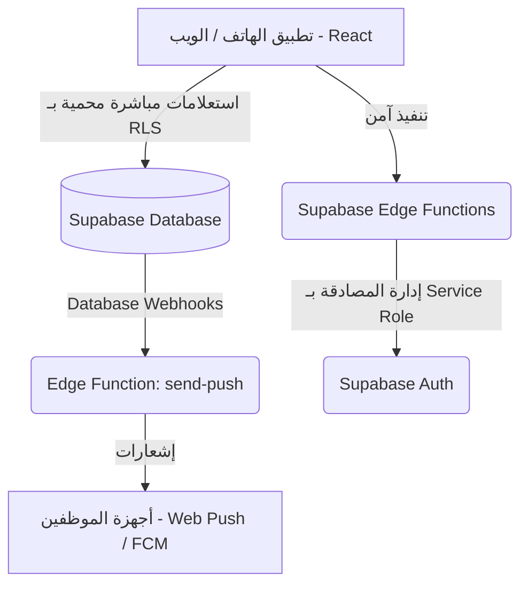

# 🚀 TaskFlow — Field Task Management System

<div align="center">
  
  <p align="center">
    <strong>تطبيق ذكي متكامل للهواتف والويب لإدارة المهام الميدانية والموظفين في الوقت الفعلي.</strong>
  </p>
  
  <p align="center">
    
    
    
    
  </p>
</div>

---

> [!NOTE]
> هذا التطبيق مبني ومجهّز بالكامل ليكون **تطبيق إنتاجي (Production-Ready)** يدعم العمل الهجين (ويب وهواتف ذكية) مع دعم حماية البيانات والعمل دون اتصال بالإنترنت.

---

## 🏛️ البنية الهندسية للتطبيق (Architecture Overview)

تعتمد بنية تطبيق **TaskFlow** على عزل الطبقات لضمان الكفاءة والأمان العالي:



---

## ✨ الميزات الرئيسية المنفذة (Core Features)

### 👥 إدارة المستخدمين وصلاحيات الشركات (Multi-Tenancy)
* **عزل تام للبيانات (RLS Policies):** سياسات حماية على مستوى قواعد البيانات تمنع بشكل قاطع تسريب أي بيانات بين الشركات المختلفة.
* **إدارة الموظفين الآمنة:** إضافة وتحديث وحذف الموظفين يتم عبر وظيفة سحابية (`create-user`) مشفرة وموثقة تمنع التلاعب بالصلاحيات.
* **تحديد السعة والحدود:** نظام محاسبة ديناميكي يمنع تخطي الحد الأقصى للموظفين المسموح به لكل شركة بناءً على باقة الاشتراك المفعلة.

### 📱 ميزات الهواتف المتقدمة (Native Shell Features)
* **المصادقة الحيوية (Biometric Login):** تفعيل الدخول السريع بالبصمة (Passkeys / FaceID) مع حفظ الجلسات بشكل مشفر محلياً.
* **التغذية اللمسية التفاعلية (Haptics):** اهتزازات خفيفة ومحسوسة تحاكي التطبيقات النيتيف عند تنفيذ الإجراءات أو حدوث الأخطاء.
* **الروابط العميقة (Deep Linking):** دعم فتح روابط استرداد كلمة المرور المنسية مباشرة داخل التطبيق وتمرير الرموز تلقائياً.
* **تصدير التقارير المتوافق (Native Sharing):** توليد تقارير PDF ومشاركتها فورياً عبر نافذة المشاركة الرسمية في الهاتف (Share Sheet) بدلاً من النوافذ المنبثقة التقليدية.

### 🌐 الاستقرار والمرونة دون إنترنت (Offline-First Design)
* **التخزين المؤقت للبيانات:** يعرض التطبيق آخر بيانات تم جلبها عند فتح التطبيق دون إنترنت لمنع الشاشة البيضاء أو ظهور رسائل الأخطاء.
* **طابور العمليات دون اتصال (Offline Queue):** تخزين العمليات محلياً ومزامنتها تلقائياً مع خوادم Supabase فور استعادة الاتصال بالشبكة.
* **الخريطة الذكية:** خريطة مهام مرنة تعتمد على Leaflet مع تنبيه وإرشاد المستخدم في حال انقطاع الإنترنت.

---

## 💻 التشغيل المحلي (Local Development Setup)

### المتطلبات المسبقة:
* تثبيت **Node.js** (الإصدار 18 أو أحدث)
* تثبيت **Supabase CLI** (مستحسن للتطوير المحلي)

### 1. تثبيت الحزم والمكتبات:
```bash
npm install
```

### 2. إعداد ملف البيئة:
قم بإنشاء ملف `.env` في المجلد الرئيسي وإضافة البيانات التالية:
```env
VITE_SUPABASE_URL=your_supabase_project_url
VITE_SUPABASE_ANON_KEY=your_supabase_anon_key
VITE_SENTRY_DSN=your_sentry_dsn_url
```

### 3. تشغيل التطبيق في وضع التطوير للويب:
```bash
npm run dev
```

---

## 📱 تشغيل وبناء تطبيق الجوال (Native Mobile Build)

يدمج المشروع إطار عمل **Capacitor** لبناء حزم تطبيقات الهواتف الذكية للأندرويد و iOS باستخدام نفس الكود البرمجي:

### 1. بناء ملفات الويب ومزامنتها مع أطر عمل الهواتف:
```bash
npm run cap:build
```

### 2. تشغيل وبناء التطبيق على نظام أندرويد (Android Studio):
```bash
npm run cap:android
```

### 3. تشغيل وبناء التطبيق على نظام آبل (Xcode):
```bash
npm run cap:ios
```

---

## 🚀 النشر وتحديث البيئة السحابية (Deployment Guide)

### 1. نشر الدوال السحابية (Deploy Edge Functions):
تأكد من تسجيل الدخول إلى Supabase CLI ثم قم بنشر الدوال اللازمة:
```bash
npm run deploy:functions
```

### 2. تهيئة المتغيرات السرية (Supabase Secrets):
تأكد من ضبط المتغيرات الأمنية الضرورية لعمل الدوال السحابية:
```bash
npx supabase secrets set WEBHOOK_SECRET=your_strong_webhook_secret --project-ref bzsmwmkgmropuadpkcku
npx supabase secrets set VAPID_PUBLIC_KEY=your_vapid_public_key --project-ref bzsmwmkgmropuadpkcku
npx supabase secrets set VAPID_PRIVATE_KEY=your_vapid_private_key --project-ref bzsmwmkgmropuadpkcku
npx supabase secrets set FIREBASE_SERVICE_ACCOUNT=your_firebase_json_content --project-ref bzsmwmkgmropuadpkcku
```

---

## 🛠️ تفاصيل البناء والتوافق (Version Info)

* **React:** 19.x
* **Build Tool:** Vite 6.x
* **CSS System:** Tailwind CSS v4
* **Native Wrappers:** Capacitor 8.x
* **PWA Engine:** Vite PWA Plugin
* **Database & Auth:** Supabase 2.x
